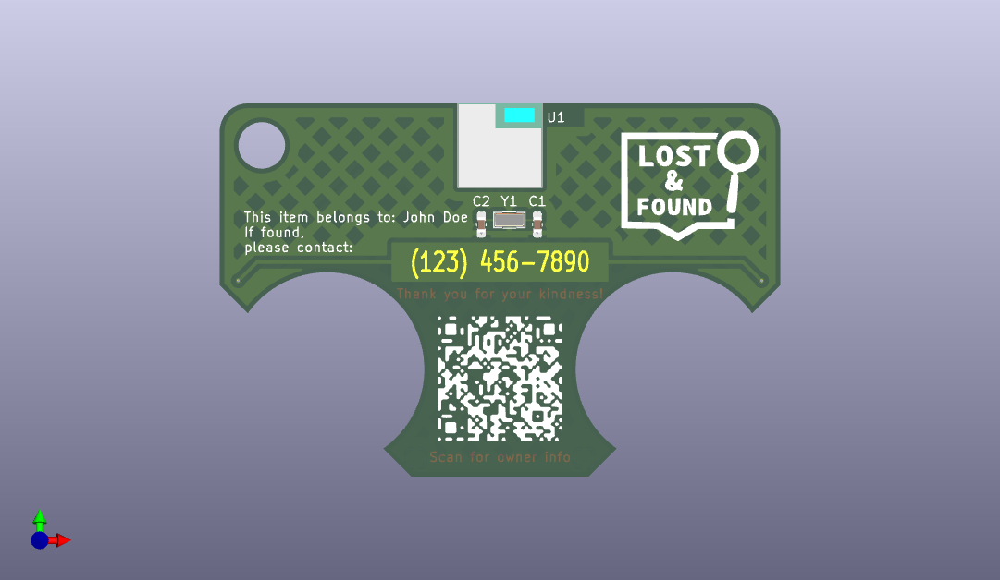
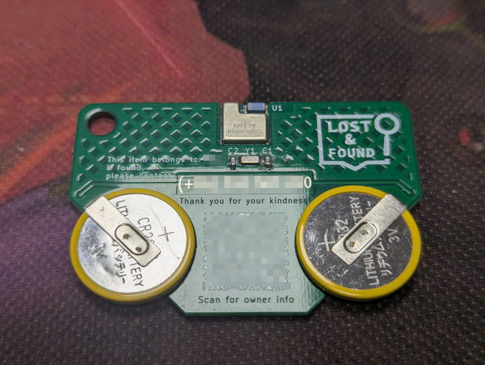
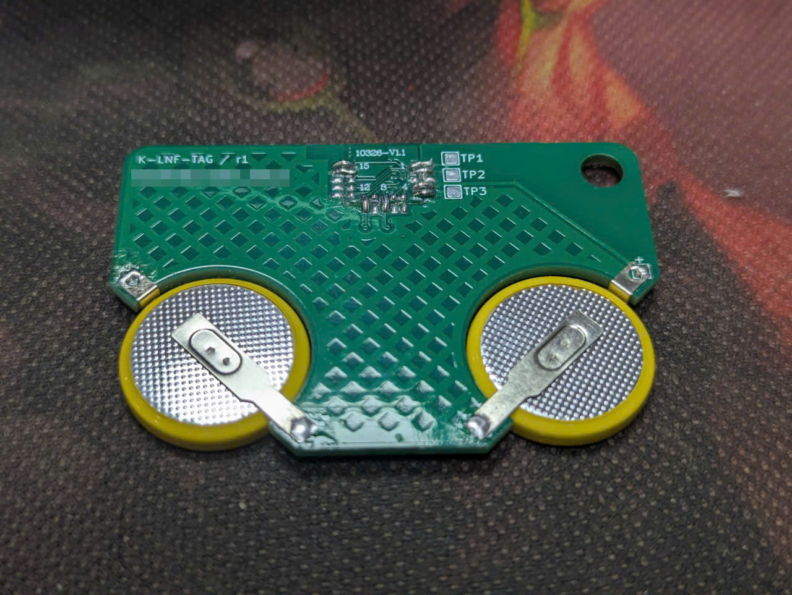
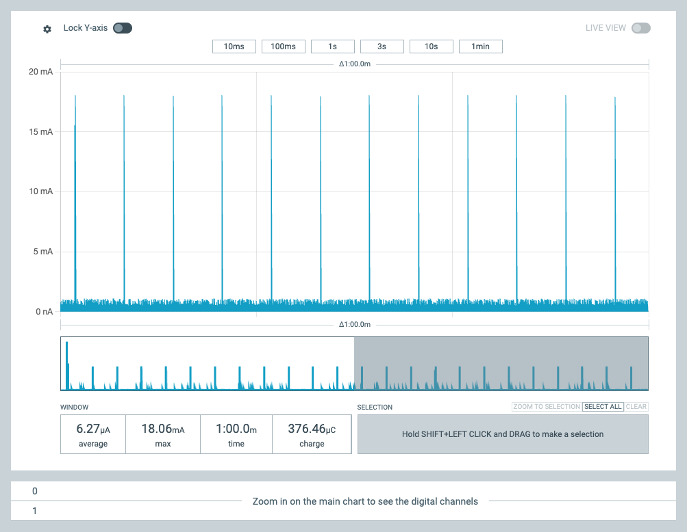

# LnF Tag

OpenHaystack-based Lost and Found Tag

<table>
<tr>
<td colspan="2"></td>
</tr>
<tr>
<td></td>
<td></td>
</tr>
</table>

## BOM

| Reference | Quantity | Description                           |
| --------- | -------- | ------------------------------------- |
| U1        | 1        | E104-BT5005A module                   |
| C1, C2    | 2        | C0603 10pF                            |
| Y1        | 1        | 3215 32.768Mhz Crystal                |
| PCB       | 1        | Custom PCB                            |
| Battery   | 2        | CR2032/CR2025/CR2016 with solder tabs |

## Battery life estimation

With the help of the XTAL, the power consumption is around 6.27uA.

| Battery type | Typical Capacity | Estimated life |
| ------------ | ---------------- | -------------- |
| 2xCR2032     | 2x220mAh         | ~8 years       |
| 2xCR2025     | 2x150mAh         | ~5.4 years     |
| 2xCR2016     | 2x75mAh          | ~2.7 years     |

## Credits

- [OpenHaystack](https://github.com/seemoo-lab/openhaystack)
- [Ultra low power alternative firmware](https://github.com/acalatrava/openhaystack-firmware)
